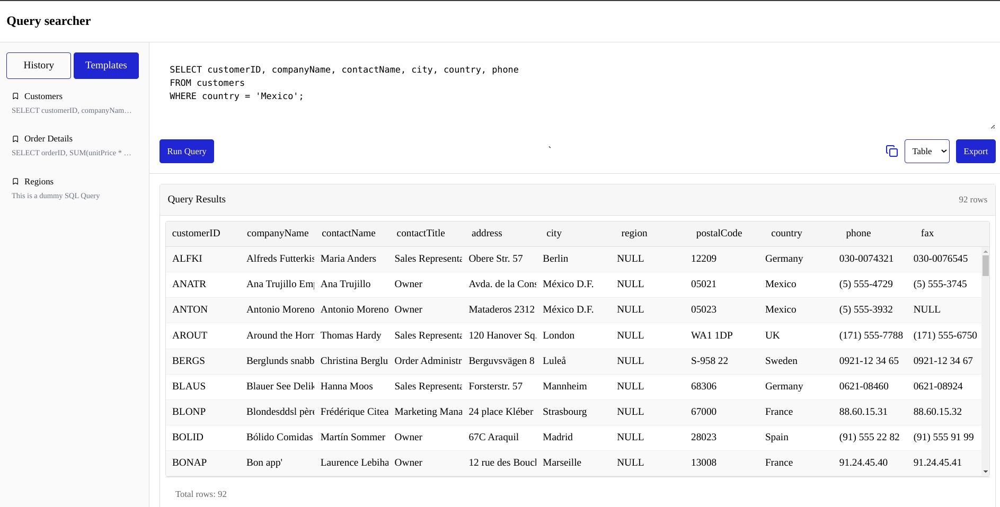

# Query Searcher

An intuitive SQL query tool inspired by MySQL Workbench designed to streamline data analysis workflows with a focus on productivity and ease of use.

## Features

### Interactive Query Editor

- Simple, distraction-free interface for writing SQL queries
- Run queries with a single click
- Copy query text to clipboard with one click for easy sharing

### Versatile Results Visualization

- **Table View**: Browse structured data with:
  - Column sorting (click any column header)
  - Virtualized rendering for smooth performance with large datasets using `react-window`
  - Row count display
- **JSON View**: See the raw data structure

### Query Management

- **History**: Access your 10 most recent queries
  - Queries automatically saved to browser storage
  - One-click to rerun previous queries
- **Templates**: Save and reuse common query patterns
  - Quick access to frequently used queries
  - Preview of query text

### Export Capabilities

- Export results as CSV for spreadsheet analysis
- Export results as JSON for programmatic use

## Application Architecture

## Tech Stack

- Frontend: React, React Virtualized
- Styling: CSS Modules

## Quick Start

1. Clone the repository:
2. `cd hokus-pokus`
3. Run `npm install` to install all the dependencies
4. Run `npm run dev` to start the application on localhost:5713

## Performance Metrics

- Metrics are calculated using Firefox Profiler.
- Used `react-window` and `useMemo` to improve the performance of the application. 

